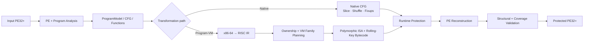

# BTG Packer

**Windows x86-64 PE Transformation & Program Virtualization Framework — Rust**

[🇺🇸 English](README.md) · [상세 문서](docs/README.md)

BTG Packer는 Windows x86-64 PE32+ 실행 파일을 분석하고 변환하는 연구용 바이너리 보호 프레임워크입니다.

단순히 원본 실행 파일 전체를 하나의 payload로 취급하지 않고, PE 구조와 프로그램 제어 흐름을 분석한 뒤 native CFG 변환 또는 x86-64 → RISC → polymorphic Program-VM 경로를 구성하고, 런타임 보호 계층과 PE 재구성 및 검증을 수행합니다.

> **Research prototype.** 자신이 소유하거나 명시적으로 분석·변환 권한을 받은 바이너리에만 사용하세요.

## 현재 구현 영역

- PE32+ 파싱/재구성, relocation, TLS directory 재작성, load config, resource, x64 unwind 처리
- 함수/CFG, code pointer, pointer table, switch, indirect target 분석
- native basic-block slicing, layout shuffle, branch/RIP-relative fixup
- arithmetic/control-flow/memory/string/일부 SIMD를 포함한 x86-64 → RISC semantic lifting
- 함수 단위 VM ownership과 function/block/instruction coverage 측정
- polymorphic Program-VM, build별 table layout, rolling-key bytecode, native threaded runtime
- multi-family VM 계획과 cross-family route/state 전환, 최종 route record의 keyed commitment 치환
- VM/native bridge와 generated unwind/lifetime metadata
- ChaCha20 / BTG-C1, integrity, payload relocation, resource registration
- IAT hiding, anti-debug, W^X memory hardening, dispatcher re-encryption
- M7 lifetime protection, M8 VM table concealment
- deterministic seed build, QA, structural validation, differential execution verification
- VM instruction/block map 및 crash diagnostic 기능

세부 구현 설명은 [docs 문서 인덱스](docs/README.md)에서 확인할 수 있습니다.

## 전체 구조



Program-VM 경로는 단순한 `x86 opcode → 고정 VM opcode` 변환기가 아닙니다. 지원되는 x86-64 의미를 내부 RISC 계층으로 lift하고, ownership/family planning을 거쳐 build별 VM 표현으로 인코딩한 뒤 생성된 native runtime으로 실행합니다.

자세한 구조: [docs/architecture.md](docs/architecture.md) · [Program-VM 내부 구조](docs/program-vm.md)

> [!NOTE]
> 기존 multi-family 기반을 확장하는 **graph-driven cooperative VM**은 현재 차세대 실험 설계로 분리해 문서화하고 있습니다. 현재 production 동작이라고 과장하지 않고 `Planned / Experimental design`으로 명확히 구분합니다: [Bidirectional Trigger Graph VM 설계](docs/design/btg-trigger-graph.md).

## 빌드

```powershell
cargo build --release
```

미리 빌드된 Windows x86-64 패키지는 [최신 GitHub 릴리스](https://github.com/uzokingkong/BTG-packer/releases/latest)에서 받을 수 있습니다. 단독 EXE와 ZIP, SHA-256 checksum 파일을 함께 제공합니다.

기본 사용:

```powershell
.\target\release\btg-packer.exe --input .\app.exe --output .\app.protected.exe
```

동일한 변환 결정을 재현하려면:

```powershell
.\target\release\btg-packer.exe --input .\app.exe --output .\app.protected.exe --seed 31010
```

## 자주 사용하는 프로필

Native 보호 예시:

```powershell
.\target\release\btg-packer.exe `
  --input .\app.exe `
  --output .\app.protected.exe `
  -l 3 --integrity --iat-hide --mem-harden
```

Full native preset (전체 프로그램 가상화가 아님):

```powershell
.\target\release\btg-packer.exe --input .\app.exe --output .\app.protected.exe --full
```

### 엄격한 전체 프로그램 Commercial 가상화

```powershell
.\target\release\btg-packer.exe `
  --input .\app.exe `
  --output .\app.virtualized.exe `
  --vm `
  --vm-oep `
  --vm-commercial `
  --m7 `
  --m8 `
  --iat-hide `
  --integrity `
  --payload-relocate `
  --rsrc-register `
  --mem-harden `
  --crypto-mode chacha20 `
  --crypto-coverage 100 `
  --obf-level 3 `
  --anti-debug `
  --anti-debug-policy trap `
  --strict-profile `
  --verify-output `
  --verify-timeout-secs 60 `
  --seed 31010
```

여기서 "전체 가상화"는 측정된 function/basic-block/instruction coverage가 모두 100%라는 뜻입니다. unresolved internal edge, unsupported instruction, capability mismatch도 모두 0이어야 합니다. 조건을 만족하지 못하면 부분 가상화 결과를 성공으로 포장하지 않고 명령 자체가 실패합니다.

프로필 적용 시 주의할 점:

- `--vm-oep`는 Program-VM 진입 경로를 활성화합니다. `--vm-commercial`의 문서화된 조합을 명확히 보여주기 위해 `--vm`도 함께 적었습니다.
- 이 엄격한 명령에 `--full`을 추가하지 마세요. `--full`은 native dispatcher re-encryption을 요청하지만 `--vm-oep`는 이를 비활성화해야 하므로, `--strict-profile`이 downgrade로 판단해 실패합니다.
- `--mem-harden`은 generated code, zero-fill `.vstate`, file-backed `.vmeta`가 분리된 `--vm-oep` 경로와 함께 사용할 수 있습니다.
- `--m7`은 commercial `--vm --vm-oep --vm-commercial` 조합에서 유효합니다. Commercial Program-VM이 없는 selective `--vm` 경로에서는 지원되지 않습니다.
- `--rsrc-register`는 `--payload-relocate`가 필요합니다.
- `--verify-output`은 exit code/stdout/stderr를 byte 단위로 비교합니다. 빌드 중 비대화형 실행이 불가능한 타깃에서만 제거하세요.

패킹 전 coverage 진단:

```powershell
.\target\release\btg-packer.exe `
  --input .\app.exe `
  --text-vm-oep
```

개발 전용 부분 coverage 빌드:

```powershell
.\target\release\btg-packer.exe `
  --input .\app.exe `
  --output .\app.partial.exe `
  --vm --vm-oep --vm-commercial `
  --m8 --integrity `
  --crypto-mode chacha20 `
  --allow-partial-vm `
  --seed 31010
```

`--allow-partial-vm`은 개발용 명시적 escape hatch이며 `--strict-profile`과 같이 사용할 수 없습니다. 이 결과를 전체 가상화라고 표현해서는 안 됩니다. 정확한 ownership/coverage는 생성된 `.btgmanifest`와 `.ownership.csv`에서 확인하고, 해당 진단 파일은 보호된 바이너리와 함께 배포하지 마세요.

## 주요 진단 옵션

```text
--verify-output   원본/보호본의 exit code, stdout, stderr 비교
--verify-seeds N  여러 seed로 pack + 실행 검증 반복
--vm-test         VM self-test
--vm-bench        VM benchmark
--text-vm         .text lift coverage 진단
--text-vm-oep     OEP reachable CFG -> VM 변환 진단
--map             instruction-level VM map 생성
--sym-map         block/ownership map 생성
--trace-blocks    runtime block tracing
--block-ring      최근 dispatch block ID 기록
```

## 상세 문서

| 주제 | 문서 |
| --- | --- |
| 설치, CLI, 사용 예시 | [Getting Started](docs/getting-started.md) |
| 코드베이스와 파이프라인 구조 | [Architecture](docs/architecture.md) |
| RISC lifter, ownership, polymorphic VM | [Program-VM](docs/program-vm.md) |
| PE 파싱/재구성, relocation, TLS, unwind | [PE Transformation Pipeline](docs/pe-pipeline.md) |
| Crypto 및 runtime hardening | [Runtime Protection](docs/runtime-protection.md) |
| Coverage, QA, 검증, 디버깅 | [Validation and Development](docs/validation-development.md) |
| 차세대 graph-driven VM 정체성 | [Bidirectional Trigger Graph 설계](docs/design/btg-trigger-graph.md) |

## Library API

`src/lib.rs`를 통해 주요 모듈이 library surface로 공개되어 있으며, 간단한 in-memory entry point도 제공합니다.

```rust
let protected: Vec<u8> = btg_packer::pack(&input_pe_bytes)?;
```

## 상태

BTG는 계속 개발 중인 연구 프로젝트입니다. 요청한 변환을 안전하게 표현하지 못하는 경우 단순히 보호 코드가 생성되었다는 이유로 성공 처리하기보다 coverage/validation 단계에서 불완전 상태를 드러내는 방향을 사용합니다.

현재 호환성 경계: commercial pre-entry TLS lifecycle gateway는 loader 안전성을 위해 attach-neutral generated stub을 사용하며, 임의의 원본 TLS callback body를 아직 가상화하지 않습니다. 따라서 custom TLS callback side effect에 의존하는 타깃은 일반 OEP coverage가 100%여도 완전한 동작 가상화를 달성했다고 볼 수 없습니다.

버그 리포트와 기여는 언제든 환영합니다.

## License

Apache License 2.0 — [LICENSE](LICENSE)
