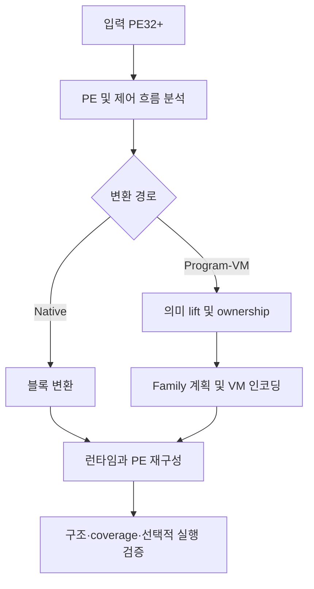

# BTG Packer


**Rust로 작성한 Windows x86-64 PE 변환 및 Program-VM 연구 프레임워크**

[English README](README.md) · [기술 문서](docs/README.md) · [릴리스](https://github.com/uzokingkong/BTG-packer/releases)

BTG는 입력 PE의 구조와 제어 흐름을 분석하고, native 코드 경로를 변환하거나 지원되는 x86-64 명령의 의미를 Program-VM으로 옮긴 뒤 출력 PE를 재구성하고 검증합니다. 생성된 VM에는 빌드별 인코딩, rolling-key 바이트코드, native handler, 여러 VM family 및 VM/native gateway가 사용됩니다. 실제로 적용되는 기능과 호환성은 입력 프로그램과 선택한 옵션에 따라 달라집니다.

## 현재 구현

| 영역 | 구현 내용 |
| --- | --- |
| PE와 native 경로 | PE32+ 파싱/재구성, CFG와 간접 분기 대상 분석, 기본 블록 분할·셔플, 분기 및 RIP 상대 주소 보정, relocation, resource, TLS, x64 unwind 처리. |
| Program-VM | x86-64 의미를 내부 RISC 표현으로 lift, 함수 ownership 및 capability 검사, 다형적 opcode/operand 배치, rolling-key 바이트코드, native threaded handler, 4종 VM family, family 간 route 및 VM/native bridge. |
| 보호 기능 | 기본 ChaCha20 계열 암호 경로, 선택적 무결성 검사, payload relocation, IAT 숨김, anti-debug, native dispatcher 재암호화, 부트스트랩 후 메모리 권한 변경, 적용 가능한 프로필에서 M7/M8. |
| 검증 | PE 구조와 실제 적용 프로필 확인, 함수/블록/명령어 단위 VM coverage 측정, seed 고정 빌드, 실행 결과 비교, QA corpus, VM 자체 테스트, 선택적 진단 매핑 파일. |

기존 `src/core/`와 `src/graph/`는 CFG·블록 변환에도 사용됩니다. 상태에 따라 트리거 노드가 VM 실행에 협력하는 **Trigger Graph VM은 [계획된 설계](docs/design/btg-trigger-graph.md)**이며 현재 Program-VM 런타임의 구현 기능으로 표시하지 않습니다. 상세 구조는 [Architecture](docs/architecture.md)와 [Program-VM](docs/program-vm.md)을 참고하세요.


```mermaid
flowchart TD
    A["입력 PE32+"] --> B["PE 및 제어 흐름 분석"]
    B --> C{"변환 경로"}
    C -->|Native| D["블록 변환"]
    C -->|Program-VM| E["의미 lift 및 ownership"]
    E --> F["Family 계획 및 VM 인코딩"]
    D --> G["런타임과 PE 재구성"]
    F --> G
    G --> H["구조·coverage·선택적 실행 검증"]
```

## 빌드와 기본 사용

Windows에서 [`rust-toolchain.toml`](rust-toolchain.toml)의 툴체인으로 빌드합니다.

```powershell
cargo build --release --locked
.\target\release\btg-packer.exe --input .\app.exe --output .\app.protected.exe
```

실제 프로그램에는 입력·출력 경로를 명시하세요. 선택한 입력 경로에 파일이 없으면 CLI가 개발용 dummy target을 생성할 수 있습니다.

동일한 변환 결정을 재현하려면 `--seed`를 지정합니다.

```powershell
.\target\release\btg-packer.exe --input .\app.exe --output .\app.protected.exe --seed 31010
```

생성 섹션의 기본 이름은 기능을 설명하는 이름입니다. `--section-name-mode seeded --seed 31010`은 seed 기반 섹션 이름을, `--section-name-mode random`은 OS 난수를 사용합니다. `random` 결과는 seed만으로 완전히 재현되지 않습니다.

## 보호 경로 선택

### Native 변환

```powershell
.\target\release\btg-packer.exe --input .\app.exe --output .\app.protected.exe -l 3 --integrity --iat-hide --mem-harden
```

`--full`은 native dispatcher 재암호화를 포함하는 폭넓은 **native** 프리셋입니다. 재암호화할 코드는 쓰기 권한이 필요하므로 해당 경로에서 `--mem-harden`의 RX 전환은 비활성화됩니다. 옵션 충돌로 요청한 기능이 빠지는 것을 거부하려면 `--strict-profile`을 사용하세요. `--full`만으로 전체 프로그램 VM 가상화가 활성화되지는 않습니다.

### Commercial Program-VM 백엔드

패킹 전 엔트리포인트에서 도달 가능한 코드의 lift 가능 범위를 확인합니다.

```powershell
.\target\release\btg-packer.exe --input .\app.exe --text-vm-oep
```

측정된 전체 coverage 계약을 요청하는 예시:

```powershell
.\target\release\btg-packer.exe `
  --input .\app.exe `
  --output .\app.vm.exe `
  --vm --vm-oep --vm-commercial `
  --m7 --m8 --integrity --iat-hide --mem-harden `
  --crypto-mode chacha20 `
  --strict-profile --seed 31010
```

일반 commercial 경로는 **함수·기본 블록·명령어 ownership이 각각 100%**인지 측정하고, unresolved internal edge·unsupported instruction·capability mismatch가 모두 0인지 확인합니다. 최종 이미지에 원본 `.text`가 실행 가능하거나 평문 그대로 남아 있는지도 검사합니다. 이는 분석한 이미지에 대한 빌드 시점의 측정치이며 모든 PE가 호환된다는 뜻은 아닙니다. VM 소유 함수에서도 생성된 native handler와 bridge를 호출할 수 있습니다.

coverage가 부족한 타깃을 개발 중이라면 `--strict-profile` 대신 `--allow-partial-vm`을 사용하고 출력된 ownership/coverage를 확인하세요. 이 결과를 전체 가상화로 표시하면 안 됩니다. `--vm-oep`는 native `--dispatcher-reencrypt`보다 우선하므로 `--full --strict-profile` 조합은 다운그레이드로 거부됩니다.

## 암호 및 옵션 조건

- 암호 계층은 기본으로 켜져 있고 기본 선택은 ChaCha20 계열입니다. `--crypto-mode c1` 또는 `--custom-cipher`를 사용하려면 **연구용** `--features experimental-custom-crypto`로 빌드해야 합니다.
- RC4는 폐기되었습니다. 기존 `--rc4`를 사용하면 조용히 다른 방식으로 바꾸지 않고 오류를 반환합니다.
- `--rsrc-register`에는 `--payload-relocate`가 필요합니다.
- M7은 native 및 commercial Program-VM 경로에 별도 구현이 있습니다. commercial 진입 경로가 없는 selective `--vm`에서는 유효하지 않습니다. M8에는 VM 활성화가 필요합니다.
- `--mem-harden`은 적용 가능한 불변 런타임 영역의 권한을 부트스트랩 후 제한합니다. native dispatcher 재암호화와는 충돌합니다.
- `--no-crypto`는 암호 계층을 끄고 여기에 의존하는 VM 요청을 무효화합니다. `--strict-profile`은 요청한 보호 기능의 다운그레이드를 거부합니다.

자세한 우선순위는 [Runtime Protection](docs/runtime-protection.md)과 `src/protection_profile.rs`에 정리되어 있습니다.

## 실행 결과 검증

`--verify-output`은 원본과 보호본을 각각 `--headless`, 빈 stdin, 제한 시간을 적용해 실행하고 **종료 코드·stdout·stderr 바이트**를 비교합니다. 해당 인수를 받아 유한하고 결정적인 비대화형 경로로 종료하는 프로그램에 사용하세요.

```powershell
.\target\release\btg-packer.exe `
  --input .\app.exe --output .\app.vm.exe `
  --vm --vm-oep --vm-commercial `
  --verify-output --verify-timeout-secs 60 --seed 31010
```

이는 실행 경로 하나의 비교이며 모든 입력의 동등성을 증명하지 않습니다. 실패한 출력은 진단을 위해 `.failed.exe` 형식의 별도 이름으로 이동합니다. `--verify-seeds N`은 여러 seed로 패킹과 실행 비교를 반복합니다.

| 진단 옵션 | 용도 |
| --- | --- |
| `--text-vm`, `--text-vm-oep` | 패킹 없이 lift coverage 확인. |
| `--vm-test`, `--vm-bench` | VM 자체 테스트와 성능 벤치마크. |
| `--test-qa`, `--qa-commercial`, `--qa-gen-corpus` | 컴파일러별 QA corpus 생성·실행. `--qa-commercial`은 `--test-qa`와 함께 사용. |
| `--map`, `--sym-map`, `--debug` | 별도 분석용 원본 주소·ownership 매핑 생성. |
| `--trace-blocks`, `--block-ring` | 지원되는 경로의 런타임 블록 진단. |

원본 주소 매핑과 ownership 보고서는 기본적으로 출력하지 않습니다. 진단 파일은 배포할 바이너리와 분리하세요. [Validation and Development](docs/validation-development.md)에 검증 절차가 있습니다.

## 호환성 및 현재 상태

BTG는 개발 중인 **연구용 프로토타입**입니다. Commercial Program-VM coverage는 발견된 프로그램 모델을 기준으로 검사하며, 특이한 제어 흐름·지원하지 않는 의미·native 의존성·로더 동작 때문에 엄격 빌드 또는 실행 결과가 실패할 수 있습니다. Windows에서 대표적인 입력과 여러 seed로 확인하세요.

현재 commercial pre-entry TLS gateway는 콜백 슬롯을 attach-neutral `ret` 스텁으로 연결합니다. 원래 TLS callback body를 임의로 실행하지는 않습니다. 해당 콜백의 부작용에 의존하는 타깃은 OEP coverage 100%만으로 완전한 동작 가상화를 주장할 수 없습니다. [PE 파이프라인](docs/pe-pipeline.md)과 [검증 문서](docs/validation-development.md)를 참고하세요.

Crate는 메모리 내 native 패킹 API도 제공합니다.

```rust
let protected: Vec<u8> = btg_packer::pack(&input_pe_bytes)?;
```

나머지 CLI 옵션은 [Getting Started](docs/getting-started.md)에 있습니다. 버그 제보와 재현 가능한 테스트 사례를 환영합니다. 소유하거나 명시적으로 변환 권한을 받은 소프트웨어에 사용하세요.

## 라이선스

[Apache License 2.0](LICENSE).
