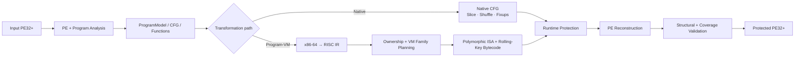

# BTG Packer

### Windows x86-64 PE Transformation & Program Virtualization Framework

[🇰🇷 한국어 문서 보기](README.ko.md) · [Detailed documentation](docs/README.md)


**BTG Packer** is a Rust research framework for analyzing, transforming and virtualizing Windows x86-64 PE32+ executables.

It combines PE reconstruction, control-flow transformation, x86-64 → RISC lifting, polymorphic Program-VM generation, runtime protection and post-build validation in one pipeline.

> [!WARNING]
> BTG Packer is a **security research prototype**, not a production commercial protector. Use it only on software you own or are explicitly authorized to transform or analyze.

## Implemented areas

The current codebase includes:

- PE32+ parsing and reconstruction, relocations, TLS-directory rewriting, load config, resources and x64 unwind metadata;
- CFG/function discovery, code-pointer, pointer-table, switch and indirect-target analysis;
- native basic-block slicing, randomized layout, branch rewriting and RIP-relative repair;
- x86-64 → internal RISC semantic lifting across arithmetic, control flow, memory, string and selected SIMD operations;
- function-level VM ownership and measured function/block/instruction coverage;
- polymorphic Program-VM encoding, build-specific table layouts, rolling-key bytecode and native threaded execution;
- multi-family VM planning and canonical cross-family routing, with final route records replaced by an opaque keyed commitment;
- VM/native bridge and generated unwind/lifetime metadata;
- ChaCha20 and BTG-C1 crypto paths, integrity, payload relocation and resource registration;
- IAT hiding, anti-debugging, W^X-oriented memory hardening and dispatcher re-encryption;
- M7 runtime lifetime protection and M8 VM table concealment;
- deterministic seeded builds, structural validation, QA and differential execution verification;
- instruction/block mapping and crash-diagnostic tooling.

For the implementation-level explanation, see the [documentation index](docs/README.md).

## Architecture at a glance



The Program-VM path is deliberately not just a fixed `x86 opcode → VM opcode` translator. Supported native semantics are lifted into an internal RISC layer, assigned through ownership/family planning, encoded into build-local VM representations, and executed by generated native runtime components.

Detailed architecture: [docs/architecture.md](docs/architecture.md) · [Program-VM internals](docs/program-vm.md)

> [!NOTE]
> BTG's next experimental design direction is a graph-driven cooperative VM execution model built on top of the existing multi-family infrastructure. It is documented separately as a **planned design**, not as a claim about current production behavior: [Bidirectional Trigger Graph VM design](docs/design/btg-trigger-graph.md).

## Build

The repository includes a pinned Rust toolchain configuration.

```powershell
cargo build --release
```

Prebuilt Windows x86-64 packages are available from the [latest GitHub release](https://github.com/uzokingkong/BTG-packer/releases/latest). The standalone executable and ZIP are accompanied by a SHA-256 checksum file.

Basic packing:

```powershell
.\target\release\btg-packer.exe --input .\app.exe --output .\app.protected.exe
```

Deterministic build:

```powershell
.\target\release\btg-packer.exe --input .\app.exe --output .\app.protected.exe --seed 31010
```

## Common profiles

Native protection example:

```powershell
.\target\release\btg-packer.exe `
  --input .\app.exe `
  --output .\app.protected.exe `
  -l 3 --integrity --iat-hide --mem-harden
```

Full native preset (not whole-program virtualization):

```powershell
.\target\release\btg-packer.exe --input .\app.exe --output .\app.protected.exe --full
```

### Strict whole-program commercial virtualization

```powershell
.\target\release\btg-packer.exe `
  --input .\app.exe `
  --output .\app.virtualized.exe `
  --vm `
  --vm-oep `
  --vm-commercial `
  --m7 `
  --m8 `
  --iat-hide `
  --integrity `
  --payload-relocate `
  --rsrc-register `
  --mem-harden `
  --crypto-mode chacha20 `
  --crypto-coverage 100 `
  --obf-level 3 `
  --anti-debug `
  --anti-debug-policy trap `
  --strict-profile `
  --verify-output `
  --verify-timeout-secs 60 `
  --seed 31010
```

This is the recommended command when "fully virtualized" means that the measured function, basic-block and instruction coverage must all be 100%. It also requires zero unresolved internal edges, unsupported instructions and capability mismatches. The command fails instead of silently producing a partially virtualized commercial image when any gate is not satisfied.

Important profile rules:

- `--vm-oep` implies the Program-VM entry path; `--vm` is included explicitly because `--vm-commercial` documents that combination.
- Do not add `--full` to this strict command. `--full` requests native dispatcher re-encryption, while `--vm-oep` must disable that feature; `--strict-profile` correctly rejects the resulting downgrade.
- `--mem-harden` is compatible with `--vm-oep` because generated code, zero-filled mutable `.vstate`, and file-backed `.vmeta` are separated.
- `--m7` is effective on the commercial `--vm --vm-oep --vm-commercial` path. It is not supported for the selective `--vm` path without commercial Program-VM.
- `--rsrc-register` requires `--payload-relocate`.
- `--verify-output` compares exit code, stdout and stderr byte-for-byte. Remove it only when the target cannot run non-interactively during the build.

Coverage-only diagnosis before packing:

```powershell
.\target\release\btg-packer.exe `
  --input .\app.exe `
  --text-vm-oep
```

Development-only partial commercial build:

```powershell
.\target\release\btg-packer.exe `
  --input .\app.exe `
  --output .\app.partial.exe `
  --vm --vm-oep --vm-commercial `
  --m8 --integrity `
  --crypto-mode chacha20 `
  --allow-partial-vm `
  --seed 31010
```

`--allow-partial-vm` is an explicit development escape hatch. It cannot be combined with `--strict-profile`, and its output must not be described as fully virtualized. Read the emitted `.btgmanifest` and `.ownership.csv` for the exact ownership and coverage results; do not distribute those diagnostic files with a protected binary.

## Useful diagnostics

```text
--verify-output   compare original/protected exit code, stdout and stderr
--verify-seeds N  repeat seeded pack + execution verification
--vm-test         run VM self-tests
--vm-bench        benchmark VM execution paths
--text-vm         inspect .text lift coverage
--text-vm-oep     inspect reachable OEP CFG -> VM conversion
--map             emit instruction-level VM mapping
--sym-map         emit block/ownership mapping
--trace-blocks    inject runtime block tracing
--block-ring      keep recent dispatched block IDs for crash triage
```

## Documentation

| Topic | Document |
| --- | --- |
| Installation, CLI and common workflows | [Getting Started](docs/getting-started.md) |
| Repository and pipeline architecture | [Architecture](docs/architecture.md) |
| RISC lifter, ownership, polymorphic VM and runtime | [Program-VM](docs/program-vm.md) |
| PE parsing, rewriting, relocations, TLS and unwind | [PE Transformation Pipeline](docs/pe-pipeline.md) |
| Crypto and runtime hardening features | [Runtime Protection](docs/runtime-protection.md) |
| Coverage gates, QA, verification and debugging | [Validation and Development](docs/validation-development.md) |
| Planned graph-driven VM identity | [Bidirectional Trigger Graph design](docs/design/btg-trigger-graph.md) |

## Library use

The crate exposes its major subsystems through `src/lib.rs`. A convenience in-memory entry point is available:

```rust
let protected: Vec<u8> = btg_packer::pack(&input_pe_bytes)?;
```

Lower-level public modules expose analysis, PE, pipeline, crypto, SDK and VM components for tests and research tooling.

## Project status

BTG is actively evolving as a research codebase. The implementation intentionally fails or reports incomplete coverage when a requested transformation cannot be represented safely instead of treating the presence of generated protection code as proof of complete protection.

Known compatibility boundary: the commercial pre-entry TLS lifecycle gateway currently preserves loader safety with an attach-neutral generated stub; it does not yet virtualize arbitrary original TLS callback bodies. A target that depends on custom TLS callback side effects is therefore not currently eligible for a claim of complete behavioral virtualization, even if ordinary OEP coverage reaches 100%.

Bug reports and contributions are welcome.

## License

Apache License 2.0. See [LICENSE](LICENSE).
