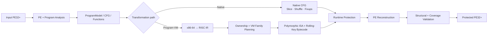

# BTG Packer

### Windows x86-64 PE Transformation & Program Virtualization Framework

[🇰🇷 한국어 문서 보기](README.ko.md) · [Detailed documentation](docs/README.md)


**BTG Packer** is a Rust research framework for analyzing, transforming and virtualizing Windows x86-64 PE32+ executables.

It combines PE reconstruction, control-flow transformation, x86-64 → RISC lifting, polymorphic Program-VM generation, runtime protection and post-build validation in one pipeline.

> [!WARNING]
> BTG Packer is a **security research prototype**, not a production commercial protector. Use it only on software you own or are explicitly authorized to transform or analyze.

## Implemented areas

The current codebase includes:

- PE32+ parsing and reconstruction, relocations, TLS, load config, resources and x64 unwind metadata;
- CFG/function discovery, code-pointer, pointer-table, switch and indirect-target analysis;
- native basic-block slicing, randomized layout, branch rewriting and RIP-relative repair;
- x86-64 → internal RISC semantic lifting across arithmetic, control flow, memory, string and selected SIMD operations;
- function-level VM ownership and measured function/block/instruction coverage;
- polymorphic Program-VM encoding, build-specific table layouts, rolling-key bytecode and native threaded execution;
- multi-family VM planning and canonical cross-family routing;
- VM/native bridge and generated unwind/lifetime metadata;
- ChaCha20 and BTG-C1 crypto paths, integrity, payload relocation and resource registration;
- IAT hiding, anti-debugging, W^X-oriented memory hardening and dispatcher re-encryption;
- M7 runtime lifetime protection and M8 VM table concealment;
- deterministic seeded builds, structural validation, QA and differential execution verification;
- instruction/block mapping and crash-diagnostic tooling.

For the implementation-level explanation, see the [documentation index](docs/README.md).

## Architecture at a glance



The Program-VM path is deliberately not just a fixed `x86 opcode → VM opcode` translator. Supported native semantics are lifted into an internal RISC layer, assigned through ownership/family planning, encoded into build-local VM representations, and executed by generated native runtime components.

Detailed architecture: [docs/architecture.md](docs/architecture.md) · [Program-VM internals](docs/program-vm.md)

> [!NOTE]
> BTG's next experimental design direction is a graph-driven cooperative VM execution model built on top of the existing multi-family infrastructure. It is documented separately as a **planned design**, not as a claim about current production behavior: [Bidirectional Trigger Graph VM design](docs/design/btg-trigger-graph.md).

## Build

The repository includes a pinned Rust toolchain configuration.

```powershell
cargo build --release
```

Basic packing:

```powershell
cargo run --release -- --input app.exe --output app.protected.exe
```

Deterministic build:

```powershell
cargo run --release -- --input app.exe --output app.protected.exe --seed 31010
```

## Common profiles

Native protection example:

```powershell
cargo run --release -- \
  --input app.exe \
  --output app.protected.exe \
  -l 3 --integrity --iat-hide --mem-harden
```

Full preset:

```powershell
cargo run --release -- --input app.exe --output app.protected.exe --full
```

Commercial Program-VM path:

```powershell
cargo run --release -- \
  --input app.exe \
  --output app.protected.exe \
  --vm --vm-oep --vm-commercial
```

The commercial path normally requires measured full VM coverage. `--allow-partial-vm` is a development-only escape hatch and conflicts with `--strict-profile`.

## Useful diagnostics

```text
Usage: btg-packer.exe [OPTIONS]

Options:
  -i, --input <INPUT>
          Input PE target binary path

          [default: dummy_target.exe]

  -o, --output <OUTPUT>
          Output protected PE binary path

          [default: protected_btg.exe]

      --strict-profile
          Fail instead of silently downgrading or disabling any requested protection feature because of an incompatible option combination

      --allow-partial-vm
          Permit a commercial Program-VM build whose measured function, block, or instruction coverage is below 100%. This is a development-only escape hatch and cannot be combined with --strict-profile

      --verify-output
          Execute the original and protected binaries after packing and fail when exit code, stdout, or stderr differ byte-for-byte

      --verify-timeout-secs <VERIFY_TIMEOUT_SECS>
          Per-process timeout used by --verify-output in seconds

          [default: 30]

      --verify-seeds <VERIFY_SEEDS>
          Run N independent seeded pack + execution-verification jobs. Each child receives --verify-output and writes a distinct seed-suffixed artifact

          [default: 0]

      --seed <SEED>
          Seed for deterministic builds. Sets RNG seeds for all randomization (block shuffling, MBA constants, crypto/poly seeds, layout padding). Same input + seed + config produces reproducible, identical output

  -l, --obf-level <OBF_LEVEL>
          Obfuscation intensity level (1: Basic, 2: MBA, 3: Overlapping + MBA)

          [default: 3]

  -a, --anti-debug
          Enable Anti-Debugging features

      --anti-debug-policy <ANTI_DEBUG_POLICY>
          Anti-debug detection failure policy: `trap` (UD2/crash, default) | `hang` (infinite stall) | `warn` (fail-open, proceed normally)

          Possible values:
          - trap:   탐지 시 `ud2` (SIGILL) — 민감 프로파일 기본
          - hang:   탐지 시 무한 루프 (`jmp $`) — 분석 툴 고정
          - warn:   탐지 시 정상 경로로 계속 (fail-open) — consumer/diagnostic
          - poison: 탐지 시 상태 오염(Stealth Poison) 후 계속 — 즉시 트랩 없이 런타임 가비지 연산 유도

          [default: trap]

  -t, --test-qa
          Run Automated Multi-Compiler QA Benchmark Suite

      --qa-commercial
          Run the QA suite through the commercial Program-VM backend and fail the command when packed output differs from the original program

      --qa-gen-corpus
          Generate real-world compiler test corpus and exit (corpus/*.exe). Builds test crates across -O0/-O1/-O2/-O3/LTO/CGU16/panic-abort/overflow-checks

  -d, --debug
          Enable verbose Debug logging mode

  -g, --log-file <LOG_FILE>
          Output log file path (optional)

      --trace-blocks
          Inject runtime block execution tracer into packed binary

      --no-crypto
          Disable composite VM encryption (boot-stub code/string encryption). By default (flag absent) the encryption layer is ON

      --vm
          Virtualize boot-stub key schedule into generated VM (bytecode + handlers). Requires the crypto layer

      --vm-test
          Run the VM self-test (lifter / interpreter / native handlers) and exit

      --text-vm
          Diagnose original .text -> VM lift coverage without packing. Decodes basic blocks from input PE and reports unsupported instructions

      --text-vm-oep
          Lift reachable CFG from EP into a single VM program and report coverage metrics without packing

      --payload-relocate
          Relocate encrypted code region to a non-executable data section (.vdata). Lowers .textb entropy to near-zero; boot stub copies and decrypts at load time

      --rsrc-register
          Register relocated payload (.vdata) as a formal RT_RCDATA resource (reconstructs PE resource directory, requires --payload-relocate)

      --crypto-coverage <CRYPTO_COVERAGE>
          Code region encryption coverage percentage (0-100, default 100). Lower values leave remaining code as CFG-flattened plaintext to lower entropy

          [default: 100]

      --chained-crypto
          256-byte chunk chained encryption with key derivation from previous chunk plaintext and self-destruction (zeroing seed/S-box/payload after decryption)

      --integrity
          Enable boot-time and runtime integrity verification (CRC32 / keyed MAC). Corrupted ciphertext or tampering triggers fail-closed response

      --iat-hide
          Hide import table — strips original import directory and replaces with minimal resolver; boot stub dynamically reconstructs IAT slots at runtime

      --mem-harden
          Memory hardening — enforces W^X permissions: immutable code/tables -> RX, mutable VM state -> RW after bootstrap. Fails closed on protection failure

      --dispatcher-reencrypt
          Dispatcher-coupled runtime block re-encryption (anti-dump). Each basic block is encrypted with a per-block key; dispatcher decrypts target block and re-encrypts previous block on every dispatch

      --full
          FULL — Enables maximum protection stack: `-l 3 -a --dispatcher-reencrypt --integrity --payload-relocate --rsrc-register --iat-hide --mem-harden`

      --vm-oep
          Redirect Original Entry Point (OEP) to the virtualized Program-VM module. Boot stub dispatches directly to VM entry instead of decrypting .text in place

      --vm-commercial
          Enable commercial Program-VM backend (RISC lifting -> polymorphic ISA -> threaded native runtime). Must be combined with `--vm --vm-oep`

      --m7
          M7: On-demand data lifetime and object-granular re-encryption (anti-dump). Protects literal data objects with decrypt-use-reencrypt lifecycle

      --m8
          M8: Conceal VM handler table addresses via MBA polynomial encoding. Table pointers are obfuscated and resolved at runtime via algebraic identities

      --vm-bench
          Run VM benchmark — measures and compares interpreter vs native VM throughput and exits

      --map
          Generate instruction-level VM bytecode mapping file (<output>.map). Maps bytecode offsets to original VAs and disassemblies for crash triage

      --sym-map
          Generate block-level symbolic mapping file (<output>.sym). Records bytecode offset ranges, original block VAs, and function ownership

      --keep-pdata
          Preserve original .pdata SEH exception table without adding dispatcher leaf entries

      --block-ring
          Inject a 32-entry dispatched block ID ring-buffer for diagnostic crash dumps

      --custom-cipher
          Explicitly specify BTG-C1 stream cipher path

      --rc4
          Retired RC4 compatibility flag. Explicitly rejected if specified

      --crypto-mode <CRYPTO_MODE>
          Select crypto primitive — `c1` | `chacha20` (default: `chacha20`). `chacha20` = RFC 8439 ChaCha20 authenticated bulk encryption. `c1` = BTG-C1 custom 512-bit stream cipher

          Possible values:
          - c1:       BTG-C1 custom 512-bit stream cipher
          - chacha20: ChaCha20 (RFC 8439) bulk stream cipher

  -h, --help
          Print help (see a summary with '-h')

  -V, --version
          Print version
```

## Documentation

| Topic | Document |
| --- | --- |
| Installation, CLI and common workflows | [Getting Started](docs/getting-started.md) |
| Repository and pipeline architecture | [Architecture](docs/architecture.md) |
| RISC lifter, ownership, polymorphic VM and runtime | [Program-VM](docs/program-vm.md) |
| PE parsing, rewriting, relocations, TLS and unwind | [PE Transformation Pipeline](docs/pe-pipeline.md) |
| Crypto and runtime hardening features | [Runtime Protection](docs/runtime-protection.md) |
| Coverage gates, QA, verification and debugging | [Validation and Development](docs/validation-development.md) |
| Planned graph-driven VM identity | [Bidirectional Trigger Graph design](docs/design/btg-trigger-graph.md) |

## Library use

The crate exposes its major subsystems through `src/lib.rs`. A convenience in-memory entry point is available:

```rust
let protected: Vec<u8> = btg_packer::pack(&input_pe_bytes)?;
```

Lower-level public modules expose analysis, PE, pipeline, crypto, SDK and VM components for tests and research tooling.

## Project status

BTG is actively evolving as a research codebase. The implementation intentionally fails or reports incomplete coverage when a requested transformation cannot be represented safely instead of treating the presence of generated protection code as proof of complete protection.

Bug reports and contributions are welcome.

## License

Apache License 2.0. See [LICENSE](LICENSE).
