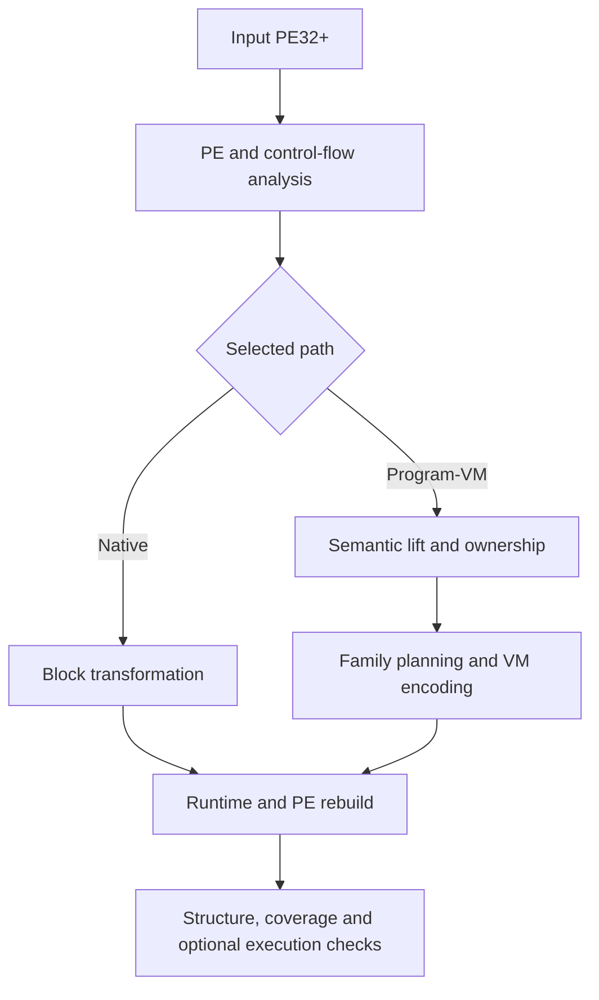

# BTG Packer


**Windows x86-64 PE transformation and Program-VM research framework**, written in Rust.

[한국어 README](README.ko.md) · [Technical documentation](docs/README.md) · [Releases](https://github.com/uzokingkong/BTG-packer/releases)

   

BTG analyzes an input PE, transforms native control flow or lifts supported x86-64 semantics into a polymorphic Program-VM, then rebuilds and validates the output image. The generated VM uses build-specific encodings, rolling-key bytecode, native handlers, multiple VM families, and VM/native gateways. A successful build is subject to the selected coverage and structural checks; support depends on the input program.

## What is implemented

| Area | Current implementation |
| --- | --- |
| PE and native path | PE32+ parsing/rebuilding, CFG and indirect-target analysis, native block slicing and shuffling, branch/RIP-relative fixups, relocations, resources, TLS and x64 unwind handling. |
| Program-VM | x86-64 semantic lifting to an internal RISC representation, function ownership, capability checks, polymorphic opcode/operand layouts, rolling-key bytecode, native threaded handlers, four architecture families, cross-family routes and VM/native bridges. |
| Protection | Default ChaCha20-based crypto path, optional integrity, payload relocation, IAT hiding, anti-debugging, native dispatcher re-encryption, post-bootstrap memory permissions, M7 lifetime protection and M8 VM table concealment where applicable. |
| Verification | Structural and effective-profile checks, measured function/block/instruction VM coverage, deterministic seeded builds, differential execution checks, QA corpus, VM self-tests and optional private mapping artifacts. |

The `src/core/` and `src/graph/` modules also support the existing CFG/block pipeline. **State-dependent cooperative Trigger Graph VM execution is a [planned design](docs/design/btg-trigger-graph.md)**; it is not a claim about the current Program-VM runtime. See [Architecture](docs/architecture.md) and [Program-VM](docs/program-vm.md) for implementation details.


```mermaid
flowchart TD
    A["Input PE32+"] --> B["PE and control-flow analysis"]
    B --> C{"Selected path"}
    C -->|Native| D["Block transformation"]
    C -->|Program-VM| E["Semantic lift and ownership"]
    E --> F["Family planning and VM encoding"]
    D --> G["Runtime and PE rebuild"]
    F --> G
    G --> H["Structure, coverage and optional execution checks"]
```

## Build and first run

Build on Windows with the toolchain specified in [`rust-toolchain.toml`](rust-toolchain.toml):

```powershell
cargo build --release --locked
.\target\release\btg-packer.exe --input .\app.exe --output .\app.protected.exe
```

Pass explicit input and output paths for a real target. Without an existing input at the selected path, the CLI can generate a dummy development target.

Reproduce a build with a fixed seed:

```powershell
.\target\release\btg-packer.exe --input .\app.exe --output .\app.protected.exe --seed 31010
```

Generated section headers use descriptive names by default. To derive names from the seed, add `--section-name-mode seeded --seed 31010`; `--section-name-mode random` uses fresh OS randomness. The latter is intentionally not byte-for-byte reproducible from `--seed` alone.

## Choose a protection path

### Native transformation

```powershell
.\target\release\btg-packer.exe --input .\app.exe --output .\app.protected.exe -l 3 --integrity --iat-hide --mem-harden
```

`--full` requests a broad **native** preset, including dispatcher re-encryption. The profile resolver applies feature precedence: native dispatcher re-encryption needs writable code and disables the RX sealing requested by `--mem-harden`. Use `--strict-profile` to reject a requested downgrade instead of accepting its warning. `--full` does not request whole-program virtualization.

### Commercial Program-VM backend

Diagnose the entry-point-reachable lift before packing:

```powershell
.\target\release\btg-packer.exe --input .\app.exe --text-vm-oep
```

Request the measured full-coverage Program-VM contract:

```powershell
.\target\release\btg-packer.exe `
  --input .\app.exe `
  --output .\app.vm.exe `
  --vm --vm-oep --vm-commercial `
  --m7 --m8 --integrity --iat-hide --mem-harden `
  --crypto-mode chacha20 `
  --strict-profile --seed 31010
```

The normal commercial path requires measured **100% function, basic-block and instruction ownership**, zero unresolved internal edges, zero unsupported instructions and zero capability mismatches. Validation also checks that original `.text` bytes do not remain executable or intact in the output. These are build-time measurements for the analyzed image, not a promise that every PE is compatible. VM-owned functions may still call generated native handlers and bridges.

For development of a target that fails the coverage gate, use `--allow-partial-vm` and omit `--strict-profile`. Inspect the reported ownership/coverage before describing that output as virtualized; the partial flag expressly relaxes the full-coverage contract. `--vm-oep` takes precedence over native `--dispatcher-reencrypt`, so combining it with `--full --strict-profile` is rejected as a downgrade.

## Crypto and option boundaries

- Crypto is on by default. The default selection is the ChaCha20-based path. `--crypto-mode c1` and `--custom-cipher` are **research-only** selections that require a build with `--features experimental-custom-crypto`.
- RC4 is retired. The legacy `--rc4` flag errors rather than switching algorithms silently.
- `--rsrc-register` requires `--payload-relocate`.
- `--m7` has separate native and commercial Program-VM implementations; it is ineffective for a selective `--vm` request without the commercial entry path. `--m8` requires effective VM support.
- `--mem-harden` seals applicable immutable runtime regions after bootstrap; it is incompatible with native dispatcher re-encryption's writable code region.
- `--no-crypto` disables the crypto layer and makes dependent VM requests ineffective. `--strict-profile` rejects requested feature downgrades.

For the complete resolver rules, see [Runtime Protection](docs/runtime-protection.md) and `src/protection_profile.rs`.

## Validate an output

`--verify-output` runs both input and output with `--headless`, null stdin and a timeout, then compares **exit code, stdout and stderr bytes**. Use it with a target that accepts that argument and has a finite, deterministic noninteractive path:

```powershell
.\target\release\btg-packer.exe `
  --input .\app.exe --output .\app.vm.exe `
  --vm --vm-oep --vm-commercial `
  --verify-output --verify-timeout-secs 60 --seed 31010
```

This checks one execution path; it does not establish equivalence for all inputs. A failed comparison moves the output to a `.failed.exe` variant for diagnosis. `--verify-seeds N` repeats seeded packing and execution verification.

| Diagnostic | Purpose |
| --- | --- |
| `--text-vm`, `--text-vm-oep` | Inspect lift coverage without packing. |
| `--vm-test`, `--vm-bench` | Run VM self-tests or the VM benchmark. |
| `--test-qa`, `--qa-commercial`, `--qa-gen-corpus` | Build/run compiler corpus QA; `--qa-commercial` applies to `--test-qa`. |
| `--map`, `--sym-map`, `--debug` | Emit private mapping/ownership evidence for isolated diagnosis. |
| `--trace-blocks`, `--block-ring` | Add supported runtime block diagnostics. |

Private original-address mappings and ownership reports are suppressed by default. Keep diagnostic artifacts separate from binaries you distribute. See [Validation and Development](docs/validation-development.md).

## Compatibility and project status

BTG is an active **research prototype**. Commercial Program-VM coverage is checked against the discovered program model; unusual control flow, unsupported semantics, native dependencies and loader behavior can still prevent a strict build or a correct execution result. Test a representative workload on Windows, especially across different seeds and inputs.

The current commercial pre-entry TLS gateway redirects callback slots to an attach-neutral generated `ret` stub. It does **not** execute arbitrary original TLS callback bodies, so a target requiring their side effects cannot claim complete behavioral virtualization solely from 100% OEP coverage. See the [PE pipeline](docs/pe-pipeline.md) and [validation notes](docs/validation-development.md).

The crate also exposes an in-memory native packing entry point:

```rust
let protected: Vec<u8> = btg_packer::pack(&input_pe_bytes)?;
```

For setup and the remaining CLI options, start with [Getting Started](docs/getting-started.md). Bug reports and reproducible test cases are welcome. Use BTG on software you own or are authorized to transform.

## License

[Apache License 2.0](LICENSE).
