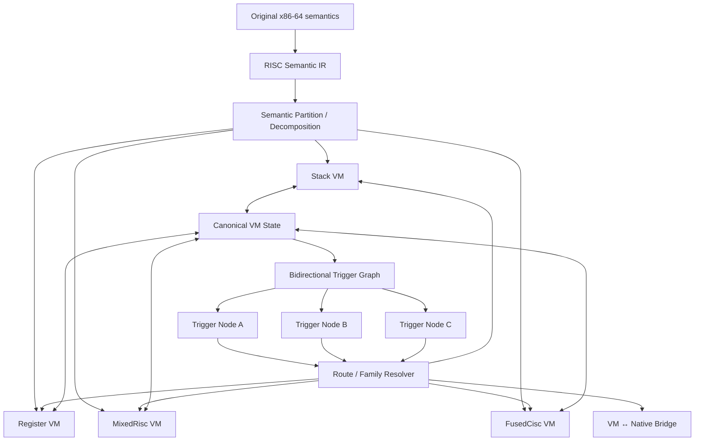
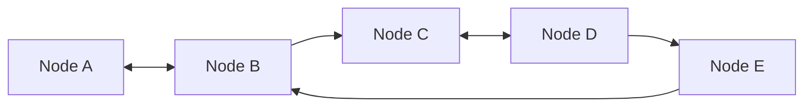
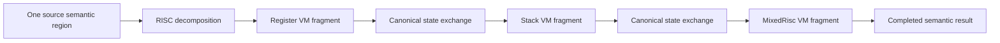
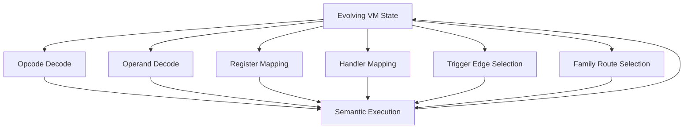
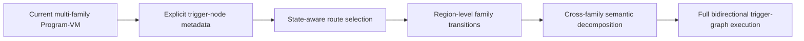

# Bidirectional Trigger Graph VM Design

> **Status: Planned / Experimental design**
>
> This document describes a proposed execution identity for future BTG Program-VM work. It is not a claim that the current production backend already implements this complete model.

## Goal

The design goal is to make BTG recognizable as more than a conventional bytecode interpreter with opcode permutation.

The proposed identity combines four ideas:

1. bidirectional trigger-graph execution;
2. cooperative heterogeneous VM families;
3. cross-family semantic decomposition;
4. evolving route/dispatch state.

The current codebase already contains several prerequisites for this direction: a RISC semantic layer, multi-family planning, canonical cross-family state, generated route metadata, polymorphic encoding and rolling-key runtime state.

## Proposed execution model



The key distinction from a conventional VM is that the intended long-term execution identity is not simply:

```text
VIP -> decode opcode -> handler -> next VIP
```

Instead, route selection can conceptually depend on a larger execution state:

```text
current VM state
+ predecessor/transition token
+ semantic event
+ active family
+ rolling decode state
-> trigger-node resolution
-> next route/family
```

## Bidirectional trigger graph

A conventional CFG primarily describes forward control transfer. The proposed BTG graph treats transition history as part of the execution contract as well.



A trigger node can consume both current state and transition metadata and then emit new route state.

Conceptually a node may have inputs such as:

```text
semantic class
predecessor token
family state
packed flags
rolling state class
```

and outputs such as:

```text
next trigger token
next VM family
route destination
updated decode/transition state
```

This would make graph topology part of the VM execution model instead of being only documentation around a linear bytecode stream.

## Cooperative VM families

BTG already models multiple VM architecture families. The proposed extension pushes that concept beyond simple function assignment.

A semantic region may eventually be decomposed across families:



The intended benefit is architectural diversity: analysis of one family's private representation does not fully describe the complete semantic operation.

## Evolving topology state

The current commercial runtime already uses rolling-key state to decode the encoded instruction stream. A future extension can make evolving state influence more than byte recovery.

Potential state-controlled domains include:

```text
opcode representation
operand representation
virtual-register mapping
handler/table mapping
condition encoding
trigger-edge selection
family route selection
```



## Relationship to the current implementation

The design should be implemented incrementally rather than replacing the existing validated backend at once.

A reasonable progression is:



Each stage should preserve the current project's fail-closed philosophy: new graph execution should not be advertised as complete until coverage, semantic equivalence and native-runtime validation can measure it explicitly.

## Documentation rule

Until a stage is implemented and validated, root README material should label it as planned or experimental. Current implemented behavior remains documented in `../program-vm.md` and `../architecture.md`.
