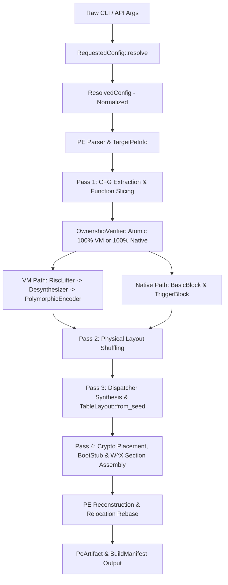

# BTG VM-OBF: Production Architecture & Pipeline Flowchart

This document details the production protection pipeline, module classification, and ownership boundaries implemented across `vm-obf`.

---

## 1. End-to-End Protection Pipeline Flow

---

## 2. Directory & Module Classification

| Directory | Responsibilities | Key Modules |
|:---|:---|:---|
| `src/core/` | Fundamental data structures and trigger block definitions | `trigger_block.rs` |
| `src/crypto/` | Cryptographic primitives (RC4, BTG-C1, ChaCha20, Poly1305) | `c1.rs`, `chacha20.rs`, `memharden.rs` |
| `src/pe/` | PE parsing, reconstruction, dummy import injection, error types | `parser.rs`, `builder.rs`, `reloc.rs`, `pe_error.rs` |
| `src/pipeline/` | Multi-pass obfuscation compiler, config normalization, artifacts | `config.rs`, `artifacts.rs`, `poly_embed.rs`, `pass1`..`pass4` |
| `src/vm/` | Core VM engines, canonical semantics, polymorphic dispatch | `canonical_semantics.rs`, `vm_context.rs`, `table_layout.rs`, `seed_lifecycle.rs`, `embed_hardening.rs` |
| `src/vm/risc/` | RISC micro-op IR, lifters, evaluation engine, math helpers | `eval.rs`, `lifter/`, `math_util.rs`, `desynth/`, `opt.rs` |
| `src/vm/poly/` | Polymorphic ISA encoder/decoder, rolling keys, interpreter | `isa_spec.rs`, `encoder.rs`, `decoder.rs`, `interpreter/`, `decode_error.rs` |
| `src/vm/threaded/`| Direct-threaded native JIT runner and P6 harness | `poly_direct/`, `native_runner.rs`, `harness.rs` |
| `src/vm/self_test/`| Comprehensive unit, differential, and fuzz test suite | `cfg_differential.rs`, `cross_path.rs`, `fuzz.rs`, `abi.rs` |

---

## 3. Security Hardening Contracts

1. **W^X Memory Enforcement**:
   - VM bytecode and tables are split across dedicated RX (`.btgvmx`), RO (`.btgvmd`), and RW (`.btgvms`) sections.
2. **Metadata Concealment**:
   - `RegionDesc` descriptor blocks are encrypted in-place with `encrypt_region_descriptor_bytes`.
   - Dispatch table unused slots trap to `ud2` handlers to prevent reverse-engineering probes.
3. **Seed Lifecycle Isolation**:
   - All build-time secrets are derived via non-linear hash `derive_seed(domain_key, region_salt)`.
4. **Function-Atomic VM Virtualization**:
   - Functions are guaranteed to be 100% virtualized or 100% native by `OwnershipVerifier`.
