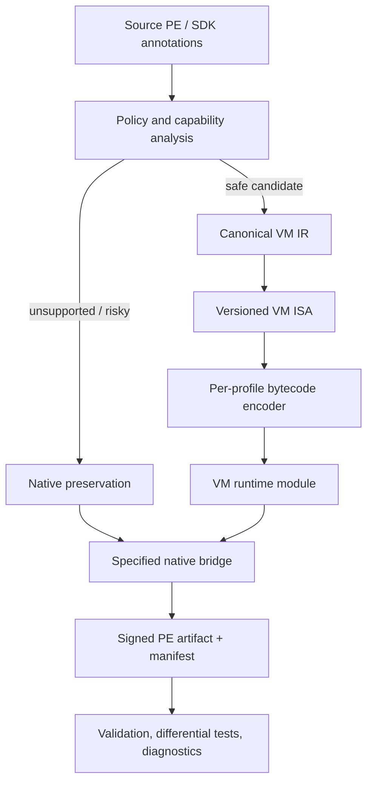

# MAXVM/BTG Packer — 소스 기반 상용 VM 컴파일러 개선 보고서

> **평가 범위:** 제공된 `src(6).zip`의 Rust 소스와 앞서 정적으로 복원한 `maxvm_full_virtualization.exe`의 실행 구조를 대조했다. 소스 아카이브에는 **212개 Rust 파일, 약 65,279 LOC, 369개 단위 테스트 선언**이 포함되어 있다. 그러나 `Cargo.toml`, `Cargo.lock`, CI 설정, README, 라이선스, 보안 정책 문서는 포함되어 있지 않아, 이 평가는 **정적 코드 리뷰**이며 빌드·실행·성능 수치는 검증하지 않았다.

## 결론 요약

이 프로젝트는 단순한 “VM 컴파일러 더미”가 아니다. 이미 **PE 재작성 파이프라인, native CFG virtualization, whole-program RISC VM lift, 폴리모픽 rolling-key bytecode, native self-decoding dispatcher, 선택적 SDK marker VM, 재암호화 모드, PE 사후 검증, 크래시 역매핑, QA 코퍼스**를 갖춘 상당히 큰 연구·프로토타입 코드베이스다.[1] [2] [3]

다만 지금의 우선 과제는 보호 기법을 더 추가하는 일이 아니다. 상용 제품으로 가기 위해서는 **의미론적 정확성 계약, 빌드 재현성, 표준 인증 암호, W^X 친화 runtime, 예외·TLS·ABI 경계의 명세, 고객 배포 신뢰성, 진단/지원 체계**를 먼저 완성해야 한다. 현재 EXE에서 보였던 대형 RWX `.textb`, 고정 dispatcher 문법, CRC 중심 integrity, 환경 결합 시드, `UD2` 중단 흐름은 소스에서도 대응 구현이 확인되며, 이들이 제품화 리스크의 핵심이다.[4] [5]

| 평가 축 | 현재 수준 | 상용화 판정 | 가장 중요한 다음 조치 |
|---|---|---|---|
| PE 패킹·CFG 보호 | 높음 | 연구/베타 수준 | 보호 프로파일과 호환성 계약 정식화 |
| whole-program VM | 중상 | 제한적 베타 | 함수 원자성·SEH·native bridge 정확성 완성 |
| selective VM SDK | 중상 | 제품화 후보 | annotation API·fallback·회귀 리포트 정식화 |
| 암호·무결성 | 중간 | 교체/통합 필요 | 표준 AEAD와 서명 manifest를 runtime에 연결 |
| 메모리 보안 | 중간 | 설계 재정비 필요 | 지속 RWX 제거, code/data 분리, W^X 계약 |
| 재현성·공급망 | 낮음 | 출시 전 필수 보완 | Cargo/lockfile/CI/SBOM/서명 release 체계 |
| QA·진단 | 중상 | 좋은 기반 | 동등성 시험 범위·CI 매트릭스 확장 |

## 1. 소스가 확인해 준 실제 제품 아키텍처

앞선 EXE 역분석에서 보인 “부트스트랩 → payload 복호화 → dispatcher → native block” 구조는 소스의 일반 패킹 경로와 정확히 대응한다. `main.rs`는 정책을 해석한 뒤 선택적 VM pass, CFG slicing, layout shuffle, block encoding, `.btg` section 조립, 데이터 patch, crypto/boot stub, PE build, 사후 validation 순으로 호출한다.[1]

```mermaid
flowchart LR
  A[Input PE] --> B[Protection profile resolve]
  B --> C[Optional SDK marker VM]
  C --> D[Pass 1: CFG extraction / micro-slicing]
  D --> E[Pass 2: layout shuffle]
  E --> F[Pass 3: RIP fixup / block encoding]
  F --> G[Pass 4: .btg / dispatcher / boot area]
  G --> H[PE & data patching]
  H --> I[Crypto / payload relocate / boot stub]
  I --> J[Optional poly VM embedding]
  J --> K[PE build]
  K --> L[Structural validation]
  L --> M[Build manifest / maps / diagnostics]
```

| 구현 경로 | 핵심 소스 근거 | EXE에서 대응된 모습 | 제품적 의미 |
|---|---|---|---|
| Native block 보호 | `pass1_slice → pass2_shuffle → pass3_encode` | 수천 native basic block이 tokenized dispatcher로 연결됨 | 현재의 안정된 기본 보호 경로 |
| Boot stub / payload | `pipeline::crypto::run` | `.vdata`에서 `.textb`로 복사 후 복호화 | 코드·문자열 보호 레이어 |
| Dispatcher re-encrypt | `ctx.reencrypt`, per-block crypto | block 단위 암호화와 state/length table | 높은 비용의 anti-tamper profile |
| Program VM | `--vm-oep` | OEP가 VM module로 진입 | 큰 보호 범위의 실험/베타 경로 |
| Commercial VM backend | `risc → poly → threaded` | rolling-key bytecode + native handler dispatch | 장기적 상용 핵심 후보 |
| Selective VM | SDK marker region pass | 특정 루틴만 VM entry trampoline으로 대체 | 현실적인 고객 적용 경로 |

### 1.1 두 개의 VM 제품이 공존한다

소스상 “VM”은 하나가 아니라 두 계열이다. 첫째는 EXE에서 확인한 **native basic block CFG virtualization**이다. native x64 블록 자체는 유지하되, 다음 edge를 암호화 table과 stack token dispatcher로 중계한다. 둘째는 `--vm-oep --vm-commercial`에서 작동하는 **instruction-level RISC VM**이다. 원본 x64 명령을 RISC micro-op으로 lift하고, 이를 seed 기반 폴리모픽 bytecode로 encode한 뒤, native self-decoding dispatcher가 opcode·operand를 해독하고 handler로 dispatch한다.[6] [7]

이 구분은 제품 설계에서 매우 중요하다. 첫 번째는 비교적 넓은 PE 호환성을 목표로 하는 기본 보호층, 두 번째는 민감 함수나 충분히 검증된 대상에 적용하는 고강도 보호층으로 분리해야 한다. 현재 코드도 그 방향으로 가고 있으나, CLI와 `--full` 정책은 두 계층을 여전히 하나의 옵션 집합으로 섞고 있다.[8]

## 2. 정적 분석 결과와 소스 구현의 교차 검증

| EXE 정적 분석에서 복원한 사실 | 대응 소스 구현 | 판단 |
|---|---|---|
| `.vdata` payload를 `.textb` 버퍼로 옮겨 runtime decrypt | crypto pipeline의 payload relocation·boot stub 경로 | 소스-바이너리 일치 |
| 공용 dispatcher와 암호화된 control-flow table | CFG slicing/shuffling/encoding 및 dispatcher modules | 소스-바이너리 일치 |
| per-block token edge와 `ret` 기반 transfer | native dispatcher 설계의 산출물 | 일반 보호 경로의 핵심 |
| RC4형 KSA/PRGA 및 CRC 중심 검사 | RC4/BTG-C1, chained crypto, integrity path | 레거시/기본 경로의 핵심 |
| 1바이트 환경값을 사용한 runtime key perturbation | boot stub의 seed·image base 파생 key 복원 | 초기 gate의 강도보다 호환성 위험이 큼 |
| 대형 RWX `.textb` | in-place decrypt 및 re-encrypt가 write 권한을 요구 | 제품화 시 W^X 설계가 필요 |
| Rust TLS/SEH/GUI test harness | QA corpus, test payload, RISC/VM self-tests | 호환성 연구의 흔적이 분명함 |

> **핵심 해석:** 현재 샘플은 “VM을 흉내만 낸 파일”이 아니라, 기본 CFG virtualization을 실제로 출력하고, 별도로 whole-program RISC VM backend를 발전시키는 코드베이스다. 다만 상용 release의 기준은 더 많은 난독화가 아니라, 보호 전후 프로그램 의미가 항상 같다는 계약을 반복적으로 입증하는 데 있다.

## 3. 강점: 이미 상용 제품의 기반이 되는 부분

### 3.1 의미론을 우선하는 all-or-nothing lift 정책

`SelectiveVmPass`는 marker region 안에 지원하지 않는 명령이 하나라도 있으면 해당 영역을 통째로 native로 남긴다. `lift_program_cfg_commercial`도 RISC lift 또는 poly ISA encoding이 불가능한 block을 가상화하지 않는 방향을 택한다.[9] [10]

이 결정은 좋다. 상용 protector에서 “조용히 일부 명령을 skip하고 대략 비슷하게 실행”하는 것은 가장 위험한 실패 방식이다. 현재 정책은 보호 coverage보다 **원본 프로그램 의미 보존**을 우선하며, 이것은 제품의 신뢰성 원칙으로 유지해야 한다.

### 3.2 상용 backend가 명확한 intermediate representation을 사용한다

상용 경로는 `RiscProgram`, virtual registers, temporary registers, virtual flags, virtual stack, memory model, branch map이라는 명시적인 상태 모델을 둔다. 폴리모픽 encoder와 native dispatcher는 같은 RISC semantics를 공유하도록 설계되어 있고, native self-decoding path와 reference interpreter의 differential test도 존재한다.[7] [11]

이는 향후 “정식 VM ISA specification”을 만들 수 있는 좋은 기반이다. 가장 중요한 개선은 새 opcode를 계속 추가하는 것이 아니라, 각 RISC op의 bit-width, flags, aliasing, memory ordering, exception effect, call ABI를 표준 문서와 자동 테스트로 고정하는 것이다.

### 3.3 사후 PE validator와 QA가 이미 존재한다

`pipeline::validate`는 빌드 직후 output PE를 재파싱해 section bounds, entry point, data directories, import/TLS/resource 보존, payload relocation, per-block decrypt round trip, re-encrypt state table 등을 확인한다.[12] QA는 원본과 packed executable의 exit/alive 상태 및 stdout hash를 비교하고, Rust 최적화 profile별 corpus도 만든다.[13]

이 두 장치는 제품화에 큰 자산이다. “패커가 성공 코드를 반환했다”가 아니라 “출력 PE가 구조적으로 유효하며, 보호 전후 행위가 특정 범위에서 일치한다”라는 방향으로 이미 가고 있다.

### 3.4 운영을 위한 mapping과 manifest의 씨앗이 있다

`--map`, `--sym-map`, RISC map CSV 및 `crash_diag` 경로가 존재해 VM fault를 원래 VA/블록/명령으로 되짚을 수 있다. `BuildManifest`는 input/output SHA-256, feature flags, VM/crypto version, build id, seed id를 기록한다.[1] [14]

제품 고객의 crash triage에서 이런 정보는 필수다. 이 기능은 난독화 runtime과 분리된 **비공개 support artifact**로 발전시켜야 한다.

## 4. 상용화 차단 요인: 우선순위가 높은 설계 격차

### 4.1 P0 — 완전한 빌드 재현성과 공급망 정보가 없다

제공된 아카이브에는 Rust source만 있고 `Cargo.toml`, `Cargo.lock`, rust toolchain pin, CI workflow, README, license, `SECURITY.md`, SBOM이 없다. 따라서 현재 상태에서는 다음을 재현할 수 없다.

| 확인 불가 항목 | 상용 제품에서의 영향 | 필요한 산출물 |
|---|---|---|
| 정확한 dependency graph | 취약 dependency와 ABI 호환성 추적 불가 | `Cargo.lock`, SBOM, license inventory |
| compiler/toolchain version | 같은 source의 binary reproducibility 불가 | `rust-toolchain.toml`, MSVC/SDK matrix |
| build script 영향 | native codegen·generated assets의 검증 불가 | `build.rs`와 generated binary provenance |
| CI release gate | 테스트가 실제 release를 막는지 불명 | signed CI attestation, required checks |
| 공개 지원 범위 | 고객이 지원 여부를 판단 불가 | README, compatibility matrix, security policy |

**권고:** 소스를 더 고치기 전 최상위 workspace를 복원하고 `cargo build --locked`가 가능한 환경을 만든 뒤, CI에서 clean checkout → deterministic build → unit/differential/integration QA → artifact hash/SBOM → signing까지 하나의 release workflow로 묶어야 한다.

### 4.2 P0 — 결정적 빌드 계약이 일부 VM 경로에서 깨질 수 있다

`main.rs`와 `PipelineContext`는 `--seed`가 주어질 때 shuffle, crypto seed, layout pad를 하나의 `StdRng`에서 파생해 동일 input+seed+config가 동일 output을 내도록 설명한다.[1] 그러나 `build_vm_module_mba`는 별도로 `rand::thread_rng()`를 사용해 MBA handler table key를 생성한다.[6] 또한 source 전반에 build path와 test path의 독립 난수원 사용 흔적이 있다.

이것은 단순한 미관 문제가 아니다. 고객 crash report의 build ID가 특정 output을 가리키려면 **모든 build-affecting randomness가 하나의 versioned derivation tree**에서 나와야 한다.

| 개선 | 구현 원칙 | 수용 기준 |
|---|---|---|
| `BuildEntropy` service 도입 | `master_seed`, purpose tag, build id, region id로 하위 RNG 도출 | `--seed` build가 byte-identical |
| entropy API 봉쇄 | production code에서 `thread_rng`/direct OS RNG 금지 | static lint가 위반을 release에서 실패 처리 |
| deterministic/non-deterministic 분리 | release는 seed를 manifest에 commit, test는 fixed seed | 동일 artifact 재생성 가능 |
| map·manifest 결속 | output hash, mapping hash, profile hash를 함께 서명 | map mismatch가 support intake에서 탐지 |

### 4.3 P0 — cryptographic product boundary가 아직 정리되지 않았다

기본 경로는 custom BTG-C1 또는 RC4 계열 stream cipher이며, integrity에는 CRC 기반 검사와 별도 custom MAC 계층이 섞여 있다. 반면 `pipeline/crypto/chacha.rs`에는 ChaCha20-Poly1305와 tag 검증이 구현되어 있으나, 파일 주석상 boot stub integration은 Phase A이며 runtime path로는 아직 이어지지 않았다.[4] [15]

현재 EXE 역분석에서 CRC가 복호화 seed 후보를 판별하는 oracle로 작동했던 것도 이 경계가 약하다는 사례다. **CRC는 전송 오류 탐지에는 유용하지만, runtime trust를 보장하는 인증 수단이 아니다.**

| 현재 상태 | 제품 리스크 | 권고 |
|---|---|---|
| custom cipher가 기본, standard AEAD는 미통합 | 외부 보안 검토·고객 신뢰·키 lifecycle가 어려움 | ChaCha20-Poly1305 또는 AES-GCM을 공식 runtime format으로 채택 |
| code/string/metadata가 별도 stream로 암호화 | blob swap·version mix-up 검증이 복잡 | section id, build id, VM ABI, architecture를 AAD에 결속 |
| CRC와 custom hash가 integrity 역할 일부 담당 | cryptographic authenticity 설명이 모호 | AEAD tag와 vendor manifest signature로 역할 분리 |
| key material이 client image에 복원 가능 | 클라이언트 비밀의 근본 한계 | per-customer entitlement와 vendor signing key를 분리 |

권고하는 순서는 **(1) 메타데이터 schema 정의 → (2) AEAD blob format 정의 → (3) native boot stub에서 tag 검증 → (4) signed manifest → (5) key/entitlement lifecycle**이다. 이 순서가 맞아야 anti-tamper와 update/rollback 정책을 안전하게 운영할 수 있다.

### 4.4 P0 — W^X와 ASLR을 보호 옵션 충돌로 취급하고 있다

현재 `--dispatcher-reencrypt`는 runtime write가 필요해 `--mem-harden`을 끄고, `--vm-oep`도 `.textb` RX 전환과 양립하지 않는 것으로 정책 처리한다.[8] crypto path는 at-rest encryption이 켜지면 loader relocation이 ciphertext를 손상시킬 수 있어 ASLR preservation을 비활성화한다고 명시한다.[4]

상용 제품에서는 이 충돌이 “경고를 내고 옵션을 끈다”로 끝나면 안 된다. 보안 profile마다 무엇을 보장하고 무엇을 포기하는지 고객이 명확히 알아야 한다.

| 문제 | 개선 설계 |
|---|---|
| code/data/state가 같은 실행 영역에 공존 | code pages, handler tables, bytecode, mutable VM state를 별도 page group으로 분리 |
| in-place decrypt가 지속 write를 요구 | decrypt-verify-execute lifecycle을 region 단위로 설계하고, 실행 전 RX 전환 |
| ciphertext relocation 문제 | relocation-aware encrypted representation 또는 image-base 독립 data blob format 채택 |
| 옵션 상충이 silent suppression | profile resolver가 machine-readable capability report와 hard/soft policy result 출력 |
| native test arena가 RWX | test-time arena도 code/data 분리와 seal transition을 release gate에서 검증 |

### 4.5 P0 — anti-debug failure가 고객 UX와 supportability를 해친다

anti-debug module은 PEB.BeingDebugged, NtGlobalFlag, RDTSC를 검사하고 탐지 시 무한 loop로 간다.[16] EXE sample에서는 `UD2` 중단으로 관찰됐다. 이런 동작은 연구 보호기에는 익숙하지만, 상용 프로그램에서는 원격 데스크톱, accessibility tooling, legitimate crash diagnosis, EDR hooks, VM 기반 기업 환경을 모두 “공격자”로 오인할 수 있다.

**권고:** anti-debug를 “기능 실행을 무조건 파괴하는 은닉 장치”가 아니라 **profile-controlled risk signal**로 다뤄야 한다. consumer/balanced/sensitive/diagnostic profile마다 정책을 나누고, 정상 고객 환경에서 발생한 integrity failure는 안전한 종료 code, support event id, opt-in local diagnostics로 연결해야 한다. privileged support build는 vendor-signed diagnostic entitlement로만 더 많은 정보를 낼 수 있게 분리하는 편이 좋다.

### 4.6 P0 — whole-program VM의 함수 경계와 SEH 정확성이 아직 제한적이다

`lift_program_cfg_commercial`에는 매우 중요한 자기 진단 주석이 있다. SEH function range 바깥에서 unsupported block 하나만 native로 남으면 VM→native 경계가 함수 중간에 생길 수 있고, 분기가 epilogue/tail로 진입해 stack frame을 깨뜨릴 위험이 있다. 코드도 이것을 잠재 리스크로 명시한다.[10]

또한 commercial RISC engine은 full-SEH virtualization이 legacy 1:1 Program VM에서만 검증됐다고 밝히며, commercial path는 최소 SEH exclusion set을 유지한다.[10] `RiscProgram::eval_state`의 `NativeCallBridge`가 reference path에서 no-op인 점도 cross-boundary semantics가 아직 완전한 reference contract로 승격되지 않았음을 시사한다.[11]

| 기능 영역 | 현재 상태 | 출시 전 요구사항 |
|---|---|---|
| 함수 원자성 | 일부 bridge redirection 구현, known edge case 존재 | `.pdata`/unwind metadata 기반 function ownership을 필수 모델로 사용 |
| SEH/C++ EH/Rust panic | 일부 제외/fallback | 지원 범위를 explicit tier로 문서화하고 handler·cleanup semantics differential test |
| native call bridge | 경계가 설계 중 | caller/callee saved regs, shadow space, alignment, return, unwind ABI 명세 |
| callbacks/vtables | test 항목 존재 | dynamic dispatch와 reentrant callback test matrix |
| TLS/initializers | native path 의존 | TLS callback ordering과 VM crossing contract 검증 |

이 항목은 보호 강도보다 우선한다. 상용 whole-program VM은 99% lift coverage보다 **100% 정확한 fallback**이 더 가치 있다.

## 5. 품질·테스트 평가

### 5.1 현재 QA의 강점

QA 코퍼스는 Rust `-O0/-O1/-O2/-O3/LTO/CGU16/panic=abort/overflow-checks` profile을 만들고, original/packed의 process 상태와 stdout hash를 비교한다.[13] 단위 테스트 수도 369개로, 마이크로-op·flags·memory·ABI·poly direct·PE validate 등의 test density는 좋은 편이다.

### 5.2 현재 QA의 한계

그러나 QA가 상용 release gate가 되려면 현재 범위를 확장해야 한다. source는 known dummy MSVC target의 `--vm-oep` crash를 이유로 해당 target을 일반 pack path로 제외하고, 외부 `BTG_QA_CORPUS` target도 `use_vm_oep=false`로 처리한다.[13] 이는 whole-program VM의 실제 다양성 coverage가 Rust 중심이라는 뜻이다.

| 현재 검증 | 빠진 검증 | 개선 방향 |
|---|---|---|
| exit code, 9초 생존 여부, stdout hash | stderr, filesystem effects, GUI/window state, registry/network mock, callback ordering | sandboxed differential oracle 설계 |
| Rust profile corpus | MSVC/clang-cl/C++ exception/COM/.NET native host/plugin/DLL | language·runtime·linker별 corpus 확대 |
| static PE validation | actual Windows Loader, ASLR, CFG, VBS/Memory Integrity matrix | Windows VM test farm 또는 signed hardware lab |
| unit differential | randomized whole-program input | property-based and metamorphic test suites |
| known unsupported diagnostics | version별 coverage trend | unsupported opcode·native fallback ratio dashboard |

**필수 release gate:** 각 profile에서 original/packed의 정규화된 observable behavior가 일치해야 하고, fallback 수·native bridge 수·uncovered opcode·startup latency·RSS·code size가 budget 안에 있어야 한다. 하나라도 budget을 넘으면 product profile을 downgrade하거나 release를 중단해야 한다.

## 6. 제품 아키텍처 권고안

### 6.1 권장 제품 분리

현재 BTG Packer의 20개 이상 CLI switch를 고객에게 그대로 노출하는 것은 상용 UX에 불리하다. 내부 옵션은 유지하되, 외부에는 적은 수의 검증된 profile을 제공해야 한다.

| 제품 profile | 대상 | 허용 기능 | 금지/제한 기능 | 고객 약속 |
|---|---|---|---|---|
| Compatibility | 플러그인, GUI, 복잡한 EH/TLS | PE hardening, data protection, 제한 CFG 보호 | whole-program VM, aggressive reencrypt | 최대 호환성 |
| Balanced | 일반 상용 app | selective VM, signed integrity, profiled CFG protection | unsupported function VM | 성능·호환성 균형 |
| Sensitive | 라이선스 핵심, proprietary algorithm | RISC/poly VM, strict integrity, entitlement binding | unverified ABI/EH route | 제한된 민감 함수의 강한 보호 |
| Diagnostic | QA·고객 지원 | original mapping, event trace, safe error codes | production anti-debug strictness | 빠른 장애 재현 |

이 프로파일은 `RequestedConfig → ResolvedConfig` 구조를 확장해 구현할 수 있다. 다만 현재처럼 conflict를 경고로 누르고 기능을 비활성화하는 방식이 아니라, **capability manifest**를 출력해야 한다. 예를 들어 `vm-oep`를 켰다면 `mem_harden=false`, `iat_hide=false`, `ASLR contract=...`, `SEH tier=...`가 output manifest에 명시되어야 한다.

### 6.2 권장 compiler/runtime boundary

| 구성요소 | 반드시 명세화할 계약 |
|---|---|
| Capability analysis | 지원 instruction, function attribute, EH/TLS/callback 제한, fallback reason |
| Canonical VM IR | operand width, flags, memory access, atomicity, FP mode, exceptions, calls |
| VM ISA | versioned opcode schema, encoding rules, forward/backward compatibility |
| Native bridge | Win64 ABI, stack alignment, shadow space, callee-saved registers, unwind metadata |
| Runtime state | thread-local/reentrant context, virtual stack bounds, per-region lifecycle |
| Artifact manifest | profile, VM ABI, crypto mode, input/output/mapping hash, entitlement policy |

## 7. 구현 로드맵

### Phase 0 — 출시 차단 요소 해소

| 작업 | 근거 | 수용 기준 |
|---|---|---|
| Cargo workspace/lockfile/toolchain/CI/SBOM 복원 | source archive에 빌드 metadata 부재 | clean checkout에서 `--locked` reproducible build |
| deterministic entropy service | `--seed`와 독립 RNG의 충돌 가능성 | 같은 input/config/seed가 byte-identical output |
| profile capability manifest | 옵션 우선순위와 suppressions 복잡 | build artifact에 effective guarantees를 구조화해 기록 |
| graceful failure policy | anti-debug infinite loop/`UD2` 계열 | authorized diagnostic mode에서 reason code 재현 가능 |
| W^X architectural plan | reencrypt/vm-oep가 RX hardening과 충돌 | product profile별 memory permission contract 문서화 |

### Phase 1 — 의미론적 정확성 강화

| 작업 | 목표 | 수용 기준 |
|---|---|---|
| function ownership model | VM/native crossing이 함수 중간으로 들어가지 않음 | `.pdata` + CFG ownership consistency check |
| bridge ABI spec | native call/callback/return/unwind 정확성 | compiler별 ABI differential suite 통과 |
| EH/TLS support tiers | 지원/제한/불가를 명확화 | target별 auto-fallback과 report 제공 |
| RISC semantic test generator | flags·width·memory·branch edgecase 탐색 | interpreter/native dispatcher/reference PE 결과 일치 |
| coverage dashboard | protection coverage를 수치화 | function/block/instruction coverage와 fallback reason 추적 |

### Phase 2 — 암호와 runtime hardening 정식화

| 작업 | 목표 | 수용 기준 |
|---|---|---|
| AEAD boot stub 통합 | ciphertext 인증·metadata binding | altered blob/AAD/version/rollback tests fail safely |
| signed manifest | vendor·release identity 보장 | PE, manifest, map hash가 함께 검증 |
| code/data/state page split | W^X 기반 runtime | 지속 RWX page 없이 representative workload 통과 |
| relocation-aware encrypted format | ASLR를 포기하지 않음 | randomized image base test에서 decrypt/execute 성공 |
| key lifecycle | customer/build/release scope 분리 | revocation/renewal/offline policy test 통과 |

### Phase 3 — 상용 SDK와 운영성

| 작업 | 목표 | 수용 기준 |
|---|---|---|
| SDK annotations | 보호 대상 함수와 fallback 정책을 source level로 제어 | no-marker/default behavior가 안정적 |
| confidential mapping service | 고객 crash를 원본 source로 역추적 | mapping access audit와 support workflow |
| compatibility matrix | 고객이 적용 가능성을 사전 판단 | compiler/OS/architecture/feature support 표 공개 |
| performance budgets | 보호 비용을 통제 | startup, steady-state, RSS, code-size baseline 관리 |
| signed release process | 사용자·기업 환경 신뢰 확보 | timestamped code-signing과 release provenance |

## 8. 실질적인 우선순위

> **첫 90일의 목표는 “더 난독화된 EXE”가 아니라, 같은 소스를 보호 전후로 항상 동일하게 실행시키고, 그 결과물의 provenance와 failure reason을 고객과 개발팀이 추적할 수 있게 만드는 것이다.**

| 순위 | 권고 | 이유 |
|---:|---|---|
| 1 | 빌드 metadata/CI/lockfile/SBOM와 deterministic build 수정 | 재현할 수 없는 protector는 상용 지원이 불가능 |
| 2 | whole-program VM ABI·function boundary·EH fallback 계약 | 가장 큰 silent correctness risk 제거 |
| 3 | W^X·ASLR·graceful failure로 runtime 재설계 | 고객 환경 호환성과 배포 신뢰 확보 |
| 4 | AEAD + signed manifest 통합 | CRC/custom cipher 중심 trust model을 제품 수준으로 정리 |
| 5 | QA corpus와 differential oracle 확대 | “works on demo”에서 “works on customer code”로 전환 |
| 6 | selective VM SDK와 profile UX 정리 | 고객이 실제로 쓸 수 있는 제어면 제공 |
| 7 | 그 뒤 VM ISA/hardener 다양화 | 보안 비용을 올리되 정확성 기반 위에서 수행 |

## 9. 정직한 제품 포지셔닝

현재 소스의 가장 정확한 포지셔닝은 다음과 같다.

| 표현 | 적절성 | 이유 |
|---|---|---|
| “단순 VM 더미” | 부정확 | 실제 PE 변환·crypto·dispatcher·RISC/poly runtime·QA가 구현됨 |
| “상용 protector 완제품” | 아직 이르다 | release supply chain, ABI/EH completeness, W^X/ASLR, broad QA가 미완성 |
| “상용화를 목표로 하는 advanced research/beta VM protector” | 가장 적절 | 핵심 engine과 validation의 기반은 강하지만 product contracts가 더 필요 |

친구분에게 전달할 핵심 피드백은 이렇다. **기술적 아이디어와 구현량은 이미 충분히 인상적이지만, 상용 VM 컴파일러의 경쟁력은 VM opcode 수나 anti-debug 기법의 수가 아니라 정확성·호환성·운영성·서명·지원 품질에서 결정된다.** 현재 프로젝트는 그 단계로 넘어갈 수 있는 기반을 이미 갖고 있다.

## 참고 소스

[1]: file:///home/ubuntu/maxvm_source/src/main.rs "전체 CLI 패킹 오케스트레이션과 feature wiring"
[2]: file:///home/ubuntu/maxvm_source/src/pipeline/mod.rs "PipelineContext와 pass 간 상태 계약"
[3]: file:///home/ubuntu/maxvm_source/src/lib.rs "라이브러리 공개 API"
[4]: file:///home/ubuntu/maxvm_source/src/pipeline/crypto/mod.rs "crypto 모드, boot stub, payload relocation, ASLR trade-off"
[5]: file:///home/ubuntu/maxvm_source/src/antidebug/mod.rs "PEB/RDTSC anti-debug runtime"
[6]: file:///home/ubuntu/maxvm_source/src/vm/mod.rs "VM module과 MBA handler table"
[7]: file:///home/ubuntu/maxvm_source/src/vm/threaded/poly_direct.rs "rolling-key self-decoding dispatcher"
[8]: file:///home/ubuntu/maxvm_source/src/protection_profile.rs "profile resolution 및 feature conflict"
[9]: file:///home/ubuntu/maxvm_source/src/pipeline/selective_vm.rs "SDK marker selective VM 및 all-or-nothing fallback"
[10]: file:///home/ubuntu/maxvm_source/src/vm/text_lift/commercial.rs "commercial whole-program lift, SEH exclusion, native bridge risk"
[11]: file:///home/ubuntu/maxvm_source/src/vm/risc/mod.rs "RISC semantics와 reference execution state"
[12]: file:///home/ubuntu/maxvm_source/src/pipeline/validate.rs "post-build PE structural validation"
[13]: file:///home/ubuntu/maxvm_source/src/qa.rs "corpus generation과 original/packed behavior QA"
[14]: file:///home/ubuntu/maxvm_source/src/manifest.rs "build manifest와 deterministic build ID"
[15]: file:///home/ubuntu/maxvm_source/src/pipeline/crypto/chacha.rs "AEAD 후보 구현과 미통합 단계"
[16]: file:///home/ubuntu/maxvm_source/src/antidebug/mod.rs "anti-debug failure behavior"
